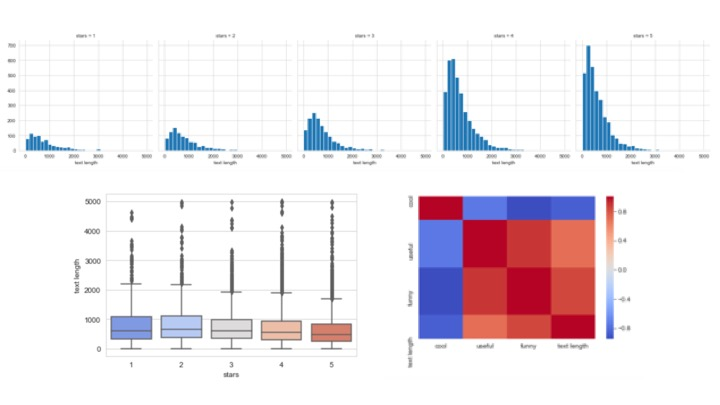
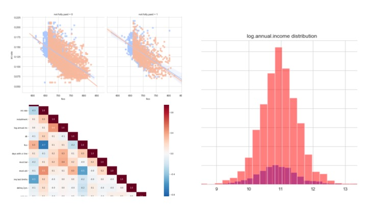
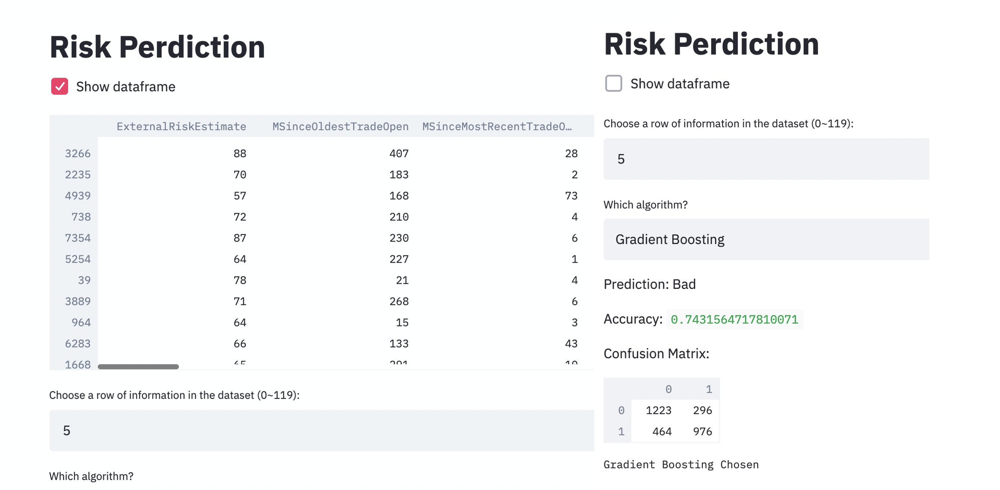

# Yuqiao (Echo) Zhong

I am currently pursuing my master of business analytics degree from Simon Business School, University of Rochester - Class of 2020. 
I aspire to become a data analyst/marketing analyst/business analyst in the technology field to leverage and enhance my professional expertise to bring valuable insights based on data analytics.
This is a porfolio page where I applied what I learned in data analytics and machine learning to some real life projects. I am currently still at learning stage. Feel free to let me know if you have any critics or questions. 

## Projects

### Kaggle: Classify Yelp Reviews with Natural Language Processing using Python 

**[View Complete Project on Github](https://github.com/echozhong1202/profolio/blob/master/Classify%20Yelp%20Reviews%20into%201%20star%20and%205%20star%20-%20Natural%20Language%20Processing%20using%20Python.ipynb)**

> My ultimate goal for this project is to predict whether a Yelp review is 1 star or 5 star based on the text content. I took a machine learning course taught by Jose Portilla on Udemy. And now I want to apply what I learned into a new project.

> The yelp review dataset is obtained from Kaggle dataset (https://www.kaggle.com/c/yelp-recsys-2013Each). Each observation in this dataset is a review of a particular business by a particular user. 

> The NLP process in this project is basic. This project is more about understanding NLP at a higher level.

### Udemy: Lending.com Applicant Trustworthiness Analysis - Exploratory Data Analysis with Python

**[View Complete Project on Github](https://github.com/echozhong1202/Portfolio/blob/master/Lending.com%20Applicant%20Trustworthiness%20Analysis%20-%20Exploratory%20Data%20Analysis%20using%20Python.ipynb)**

> Lending Club connects people who need money (borrowers) with people who have money (investors). Here we will use Python with some packages like Pandas, Matplotlib and seaborn to analyze a dataset that was collected on lending.com over 2007-2010. The dataset contains data on more than 9000 borrowers and borrowers' features like income, FICO, interest rate, etc.

> We will analyze this data to get insights on the main difference between fully paid borrowers and not fully paid borrowers. These insights might also be used by people in landing.com to better predict whether the borrower will pay in full or not

### Credit Risk Prediction Model and Interactive Interface - Predictive Analysis with Python

**[View Complete Project on Github](https://github.com/echozhong1202/Portfolio/blob/master/Credit%20Risk%20Prediction%20Model%20and%20Interactive%20Interface.ipynb)**

> Our goal for this project is to develop a predictive model and a decision support system (DSS) that evaluates the risk of Home Equity Line of Credit (HELOC) applications. Ultimately, the decision support system, which is essentially an interactive interface, is able to give understandable explanations for sales representatives in a bank/credit card company. Even without coding experience, they can easily use the system to decide on accepting or rejecting applications.

